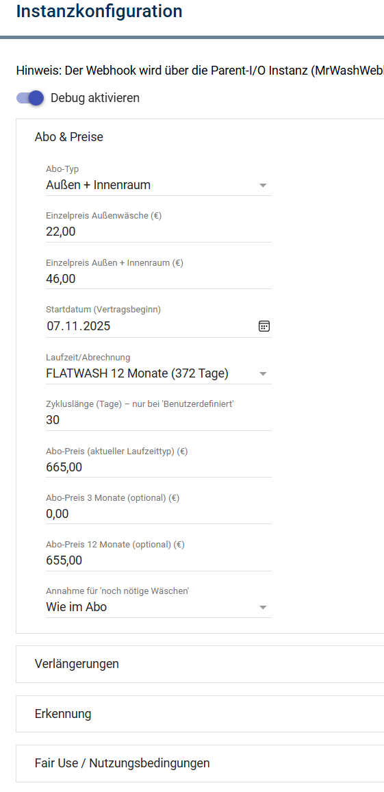
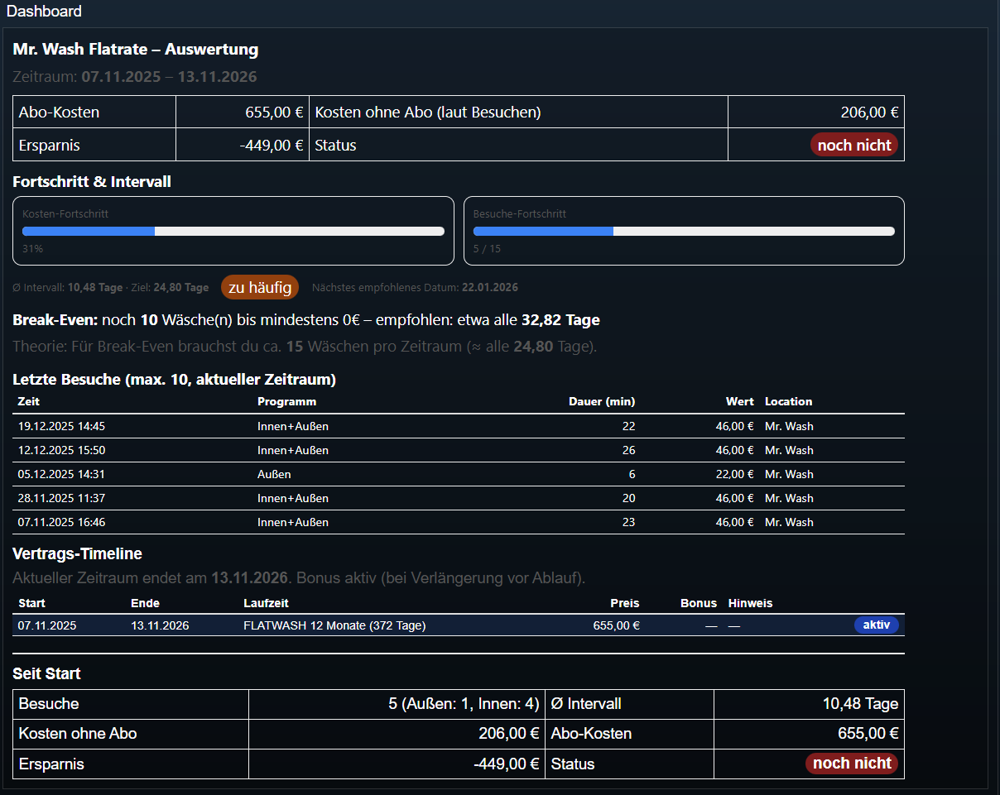

# MrWashFlatrate (Device)

Device-Modul für IP-Symcon zur Auswertung der Mr. Wash Flatrate.

Das Device erhält Webhook-Events über den **MrWashSplitter** und berechnet daraus:
- Visits (Außen / Innen+Außen)
- Kostenvergleich (Abo vs. Einzel)
- Break-Even (fehlende Wäschen, empfohlenes Intervall)
- letzte Besuche
- Fair-Use Warnungen

---

## Einrichtung

1. Instanz erstellen: **MrWashFlatrate**
2. Als Gateway/Parent auswählen: **MrWashSplitter**
3. Konfiguration setzen (Abo, Preise, Schwellwert, Fair-Use, Verlängerungen)

<!-- ABBILDUNG: Device-Konfiguration (Abo/Preise/Schwellwert/Fair-Use) -->


---

## Wichtige Einstellungen

### Abo & Preise
- Abo-Preis
- Einzelpreis Außen
- Einzelpreis Innen+Außen
- Startdatum
- Laufzeit (3 Monate / 12 Monate / benutzerdefiniert)
- Verlängerungen (Liste)

### Programmerkennung (Innenraum)
- **Schwellwert (Minuten)**: Standard 15  
  Alles über der Schwelle wird als „Innen+Außen“ gewertet (wenn Option aktiv).

### Option „nur ein Event“ (Single-Event Mode)
Wenn nur ein Event pro Besuch genutzt wird (z. B. nur Exit), wird dieser Besuch immer als **Außenwäsche** gezählt.

---

## Historie

### Intern (für Berechnungen)
- Visits werden intern auf die letzten **400 Tage** begrenzt (Attribut)

### Archiv (für Auswertungen)
- Variable `HistoryJSON` enthält die vollständige Historie als JSON (editierbar)
- Logging im Archive Control ist aktiviert (für spätere Auswertungen)

Format eines Eintrags:
```json
{
  "timestamp": 1766137200,
  "datetime": "2025-12-19T10:40:00+01:00",
  "program": "Innen+Außen",
  "durationMin": 40,
  "value": 40,
  "location": "MrWash_Test",
  "device": "TestPhone"
}
```

<!-- ABBILDUNG: HistoryJSON Variable (JSON-Array) -->
<!--  -->

---

## Dashboard

<!-- ABBILDUNG: Dashboard Device -->


---

## Debugging

- Device Debug zeigt:
  - eingehende Payloads
  - Entry/Exit Pairing
  - berechnete Dauer
  - Programmentscheidung

Wenn im Device nichts ankommt:
- Splitter Debug prüfen (`Children connected`)
- Gateway-Verbindung prüfen (Device muss am richtigen Splitter hängen)
