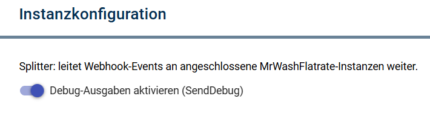
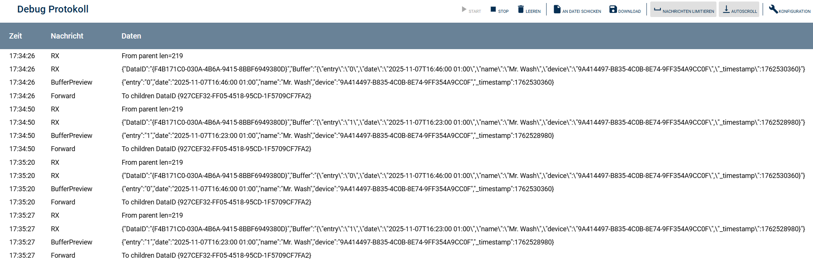

# MrWashSplitter (Splitter)

Splitter-Modul für IP-Symcon.

Aufgabe:
- Empfang von Daten vom **MrWashWebhookIO**
- Weiterleitung an verbundene **MrWashFlatrate** Device-Instanzen

---

## Einrichtung

1. Instanz erstellen: **MrWashSplitter**
2. Als Parent auswählen: **MrWashWebhookIO**
3. Optional: Debug aktivieren

<!-- ABBILDUNG: Splitter-Konfiguration -->

---

## Debugging

Im Splitter-Debug siehst du typischerweise:
- `RX From parent ...`
- `Forward To children ...`
- optional `Children connected=...`

Wenn RX sichtbar ist, aber im Device nichts ankommt:
- Prüfe, ob das Device wirklich an diesem Splitter hängt
- Prüfe `Children connected` (sollte >= 1 sein)

<!-- ABBILDUNG: Splitter Debug -->

