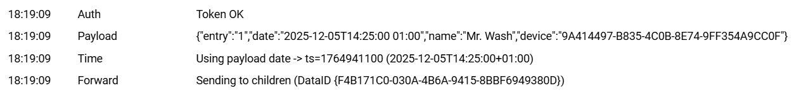

# MrWashWebhookIO (I/O)

I/O Modul für IP-Symcon, das Webhook Requests entgegennimmt (z. B. Geofency).

Funktionen:
- Webhook Registrierung
- Token-Validierung
- Normalisierung des Payloads (Form-Encoded / JSON)
- Zeitstempel-Erkennung aus `date` (ISO-8601) + Fallback
- Weiterleitung an den Splitter

---

## Einrichtung

1. Instanz erstellen: **MrWashWebhookIO**
2. Token erzeugen
3. Beispiel-URL kopieren und im Webhook Sender (Geofency) hinterlegen

<!-- ABBILDUNG: IO Token + Beispiel-URL (kopierbar) -->


---

## Webhook URL

Schema:
```
http://<SYMCON-IP>:3777/hook/MrWash/<IOID>?token=<TOKEN>
```

---

## Beispiele

### Form-Encoded

```bash
curl -i -sS -X POST "http://<SYMCON-IP>:3777/hook/MrWash/<IOID>?token=<TOKEN>" \
  --data-urlencode "entry=1" \
  --data-urlencode "date=2025-12-19T10:00:00+01:00" \
  --data-urlencode "name=MrWash_Test" \
  --data-urlencode "device=TestPhone"
```

### JSON

```bash
curl -i -sS -X POST "http://<SYMCON-IP>:3777/hook/MrWash/<IOID>?token=<TOKEN>" \
  -H "Content-Type: application/json" \
  -d '{"entry":1,"date":"2025-12-19T10:00:00+01:00","name":"MrWash_Test","device":"TestPhone"}'
```

---

## Debugging

- Bei 403: Token falsch
- Bei „Hook not found“: Hook nicht registriert / falscher Pfad / WebHook Control Problem
- Bei Datum/Timezone: `+` muss urlencoded werden (`--data-urlencode`)

<!-- ABBILDUNG: IO Debug (Payload/Token/Date) -->

