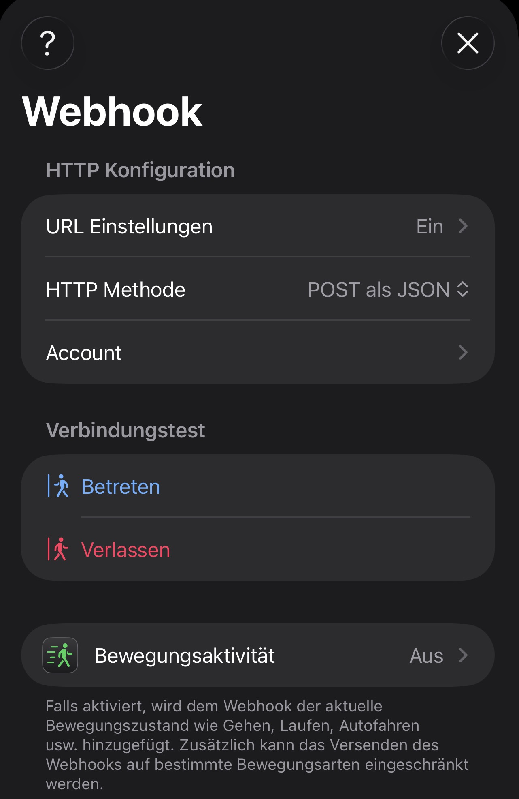
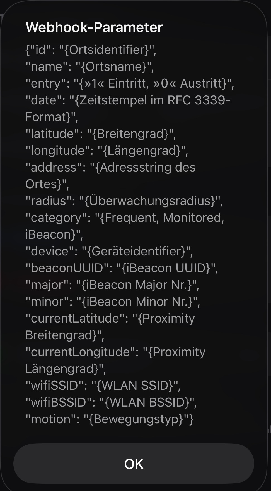
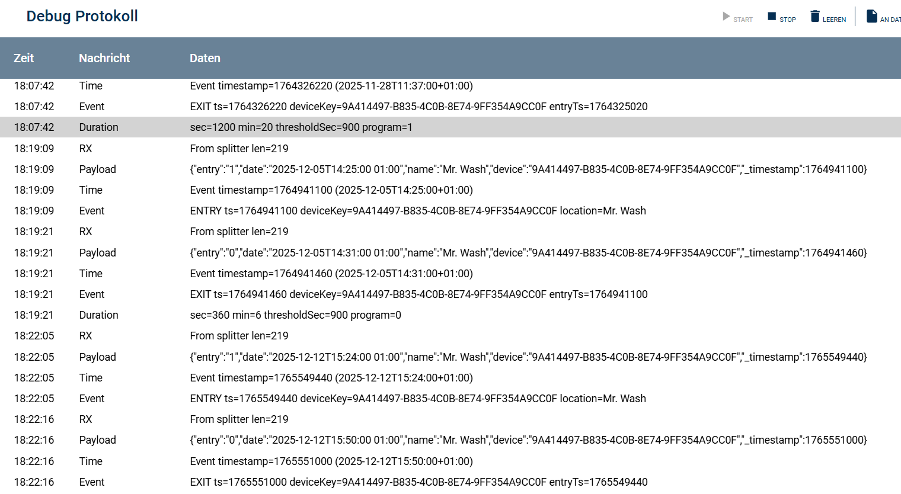

[](https://www.symcon.de/service/dokumentation/entwicklerbereich/sdk-tools/sdk-php/)
[]()
[](https://creativecommons.org/licenses/by-nc-sa/4.0/)  
[](https://community.symcon.de/t/ip-symcon-8-1-stable-changelog/40276)

# MrWash Flatrate (IP-Symcon)

IP-Symcon Modul zur automatischen Auswertung, ob sich die **Mr. Wash Flatrate** für dich lohnt – inklusive Webhook-Anbindung (z. B. Geofency), automatischer Programmerkennung (Außen vs. Innen+Außen), Break-Even-Berechnung, Fair-Use-Warnungen und Historie.

> Unterstützt IP-Symcon **8.1**.

---

## Features

- ✅ Webhook-Empfang über eigenes I/O-Modul (Geofency kompatibel)
- ✅ Splitter-Modul zur Datenverteilung an mehrere Device-Instanzen
- ✅ Device-Modul mit:
  - Auswertung „lohnt sich / lohnt sich nicht“
  - Break-Even: **wie viele Wäschen fehlen** + **empfohlenes Intervall**
  - letzter Besuch inkl. Programm / Dauer / Location / Device
  - Fair-Use/Nutzungsbedingungen: Warnung bei „übertriebener“ Nutzung (konfigurierbar)
- ✅ **HistoryJSON** als editierbares Archiv (JSON) + internes Rolling-Window (400 Tage) für Berechnungen
- ✅ Debugging getrennt pro I/O, Splitter und Device

---

## Modulstruktur

Dieses Repository enthält drei Module:

- **MrWashWebhookIO** (I/O): Webhook-Endpunkt, Token-Validierung, Payload-Aufbereitung
- **MrWashSplitter** (Splitter): verteilt eingehende Webhook-Daten an Device-Instanzen
- **MrWashFlatrate** (Device): speichert Visits, berechnet Kennzahlen, liefert Dashboard

---

## Voraussetzungen

- IP-Symcon **8.1**
- Optional: Geofency (iOS) oder ein anderer Webhook-Sender
- WebHook Control muss erreichbar sein (Port/Firewall/Reverse Proxy beachten)

---

## Installation

### Installation via Module Control (empfohlen)

1. IP-Symcon Konsole öffnen
2. **Module Control** → **Modules** → **Add**
3. Repository-URL eintragen:
   - `https://github.com/TheEldar/MrWashFlatrate.git`
4. **Install** klicken

### Manuelle Installation

1. Repository nach `/var/lib/symcon/modules/` klonen:
   ```bash
   cd /var/lib/symcon/modules
   git clone https://github.com/TheEldar/MrWashFlatrate.git MrWashFlatrate
   ```
2. IP-Symcon Dienst neu starten:
   ```bash
   sudo systemctl restart symcon
   ```

---

## Schnellstart (Einrichtung)

### 1) Instanzen anlegen

1. **MrWashWebhookIO** erstellen
2. **MrWashSplitter** erstellen (als Parent das IO auswählen oder Auto-Connect nutzen)
3. **MrWashFlatrate** erstellen (als Gateway den Splitter auswählen)

> Wenn IO/Splitter bereits existieren, werden sie wiederverwendet. Falls nicht vorhanden, können sie (je nach Konfiguration/Version) automatisch erstellt/verbunden werden.

---

### 2) Webhook URL generieren

Im **MrWashWebhookIO**:
- Token erzeugen/anzeigen
- Beispiel-Webhook-URL kopieren

<!-- ABBILDUNG: IO-Konfiguration mit Token + kopierbarer Beispiel-URL -->


---

### 3) Geofency konfigurieren (Beispiel)

In Geofency einen Standort (Waschstraße) anlegen und bei Eintritt/Austritt Webhooks senden.

Vorgaben:
- Eintritt → `entry=1`
- Austritt → `entry=0`
- `date` als ISO-8601 Timestamp mitsenden (Geofency macht das typischerweise automatisch)


Die URL die in der Konfiguration des Standort eingestellt sein muss muss folgendermaßen aussehen.
```
https://<Symcon-URL>/hook/MrWash/<ID-MrWashFlatrate>?token=<Secret-Token>
```
<!-- ABBILDUNG: Geofency Webhook Konfiguration (Enter/Exit) 
 -->


#### Geofency JSON

Standard Aufbau der Geofency JSON:
<!-- ABBILDUNG: Geofency Webhook JSON 
 -->


Alle Apps, die folgende Felder übertragen
- entry
- date
- name
- device

sind aktuell zur I/O-Instanz kompatibel. Weitere Geofenc APPs können ergänzt werden. Gerne einen Push Request erstellen.

---

## Webhook Payload (Beispiele)

### Form-Encoded (curl)

```bash
curl -i -sS -X POST "http://<SYMCON-IP>:3777/hook/MrWash/<IOID>?token=<TOKEN>" \
  -d "entry=1" \
  -d "date=2025-12-19T10:00:00+01:00" \
  -d "name=MrWash_Test" \
  -d "device=TestPhone"
```

> Hinweis: Bei `-d "date=...+01:00"` wird `+` als Leerzeichen interpretiert. Nutze daher `--data-urlencode` oder `%2B`.

### JSON (curl)

```bash
curl -i -sS -X POST "http://<SYMCON-IP>:3777/hook/MrWash/<IOID>?token=<TOKEN>" \
  -H "Content-Type: application/json" \
  -d '{"entry":1,"date":"2025-12-19T10:00:00+01:00","name":"MrWash_Test","device":"TestPhone"}'
```

---

## Dashboard / Auswertung

Die Device-Instanz erzeugt ein Dashboard im WebFront mit:

- Zeitraum/Vertrag
- Kostenvergleich (Abo vs. Einzel)
- Break-Even (fehlende Wäschen + Intervall)
- Letzte Besuche (Programm/Dauer/Wert/Location)
- Fair-Use Warnungen (optional)

<!-- ABBILDUNG: Dashboard Übersicht im WebFront -->


---

## Historie

- **Intern (Attribut)**: Visits werden für die Berechnung auf die letzten **400 Tage** begrenzt (Performance/Übersicht)
- **Archiv (Variable `HistoryJSON`)**: vollständige Historie als JSON, leicht editier- und exportierbar

<!-- ABBILDUNG: HistoryJSON Variable (JSON-Array) -->
<!--  -->

---

## Debugging

Debug-Schalter sind getrennt pro:
- IO
- Splitter
- Device

Typische Prüfkette:
1. IO Debug: Token OK? Payload erkannt? Timestamp erkannt?
2. Splitter Debug: RX vom Parent? Forward an Children?
3. Device Debug: ReceiveData angekommen? Visit gespeichert? Dauer berechnet?

<!-- ABBILDUNG: Debug-Ausgaben IO → Splitter → Device -->


---

## Troubleshooting

### „Hook not found“
- Prüfen, ob WebHook Control läuft und die Hook registriert ist
- Richtigen Pfad / Port / Token prüfen
- Firewall / Reverse Proxy prüfen

### „Keine Daten kommen im Device an“
- Splitter Debug prüfen: `Children connected=0` → Device hängt nicht am richtigen Splitter
- Gateway-Verbindung prüfen (Device muss am richtigen Splitter hängen)

### Datum wird nicht erkannt
- Bei form-encoded muss das `+` urlencoded werden (`--data-urlencode`)

---

## Lizenz

  IPS-Modul:  
  [CC BY-NC-SA 4.0](https://creativecommons.org/licenses/by-nc-sa/4.0/)  

---

## Credits / Spenden / Hinweise

Dieses Projekt ist ein Community-Modul und steht in keiner offiziellen Verbindung zu Mr. Wash.

Die Library ist für die nicht kommerzielle Nutzung kostenlos. Kleine Dankeschöns als Unterstützung für den Autor werden hier akzeptiert:

<a href="https://www.paypal.com/cgi-bin/webscr?cmd=_s-xclick&hosted_button_id=MBVXFVK8WED4C" target="_blank"></a>

 